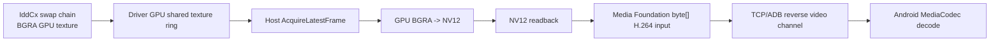

# SideDock 2K@120 性能优化方案

更新时间：2026-05-26

## 1. 当前实测基线

本方案基于最近一次干净测试：

```text
测试目录：
artifacts/validation/idd-gpu-20260526-2k120-clean-20260526-172950/

模式：
2560x1440 @ 120Hz
video-source = idd-gpu
encoder = mediafoundation-nv12-readback
bitrate = 64 Mbps(auto)
```

关键结果：

```text
Android:
  decodeErrors = 0
  videoReconnects = 0

活跃窗口统计：
  capture fps avg 约 71.5
  encode fps  avg 约 71.6
  sent fps    avg 约 71.6

Host GPU 路径：
  avgAcquire      约 3.68 ms
  avgGpuConvert   约 0.40 ms
  avgEncode       约 2.02 ms
  maxEncodeSeen   约 32.30 ms
  avgSend         约 0.10 ms
  avgKbps         约 8.2 Mbps

丢帧：
  capture dropped delta 约 3920
  encoder dropped delta 约 75
```

结论：

- `2K@120` 模式可以成功切换。
- Android 解码和连接稳定，当前不是主要瓶颈。
- GPU BGRA -> NV12 转换已经足够快，当前也不是主要瓶颈。
- 网络发送平均约 `0.10ms`，也不是主要瓶颈。
- 当前主要问题是：**Host 没有稳定消费/编码到 120fps，新帧吞吐约 70fps；同时编码存在偶发峰值。**

需要注意：当前 `roughLatencyMs` 仍容易受时钟偏移、静态帧复用和 stale frame 影响，不能单独作为真实端到端延迟指标。

## 2. 已完成的关键优化

当前项目已经完成了最关键的第一阶段：

- Driver 从 IddCx swap chain 导出 GPU shared texture ring。
- Host 新增 `idd-gpu` 路径。
- Host 使用 GPU VideoProcessor 做 BGRA -> NV12。
- Android overlay 展示 `gpuPath`、`fallback`、`gpuConvertMs`、`framesDropped`、`lastFrameAgeMs`。
- CPU BGRA 路径保留为 fallback。

当前实际链路：



它已经避开了早期最重的 CPU `BGRA -> NV12`，但还没有达到完整零拷贝。

## 3. 当前瓶颈判断

### 3.1 GPU ring 消费与串行管线

当前 `MediaFoundationGpuVideoSource.EncodeLoopAsync` 基本是串行做：

```text
AcquireLatestFrame
-> GPU convert
-> NV12 readback
-> Media Foundation EncodeFrame
-> packet queue
```

这个循环在 `2K@120` 下很容易错过 driver ring 中的帧。实测 capture dropped 明显增长，说明 Host 经常跳过旧 slot，只拿最新帧。

这对低延迟是对的，但对 120fps 吞吐说明目前 Host 消费节奏跟不上 driver 产帧节奏。

### 3.2 NV12 readback fallback 仍然存在

本机 Media Foundation H.264 MFT 对 `MFT_MESSAGE_SET_D3D_MANAGER` 返回 `E_NOTIMPL`，所以当前不能直接把 D3D11 NV12 texture 喂给 Microsoft H.264 MFT。

实际 fallback 是：

```text
GPU BGRA -> GPU NV12 -> NV12 readback -> Media Foundation byte[] input
```

这比 CPU BGRA 转 NV12 快很多，但仍然不是完整 GPU 常驻。

### 3.3 编码峰值会破坏 120fps 稳定性

`2K@120` 单帧预算是：

```text
1000 / 120 = 8.33 ms
```

当前平均编码约 `2ms`，但 `maxEncodeSeen` 可到 `32ms`，这类峰值会直接造成队列堆积或丢帧。

### 3.4 Android 不是当前主瓶颈，但还缺少真实 render latency

Android 侧 `decodeErrors=0`、`videoReconnects=0`，说明解码器能吃下当前码流。下一步应该测真实 render timing，而不是只看 packet timestamp。

## 4. 优化路线总览

推荐按下面顺序做。

| 优先级 | 方向 | 目标 | 预期收益 |
|---|---|---|---|
| P0 | 重做测量指标 | 找准真实瓶颈 | 避免误判 latency / fps |
| P0 | 拆分串行管线 | capture/convert/encode 解耦 | 提升稳定帧率，降低 ring drop |
| P0 | 增大 GPU ring / texture pool | 减少 slot overwrite | 提升 120fps 吞吐余量 |
| P1 | 直接 D3D11 输入编码器或 vendor encoder | 去掉 NV12 readback | 降低峰值和 CPU/GPU 同步 |
| P1 | Android decoder 低延迟配置 | 减少 decode/render 排队 | 降低端侧延迟 |
| P1 | 自适应帧率/重复帧策略 | 静态画面不做无意义编码 | 降低延迟和功耗 |
| P2 | HEVC/AV1 可选编码 | 降低码率 | 兼容性和延迟需验证 |
| P2 | ROI/dirty-region | 降低编码复杂度 | 复杂度较高，后置 |

## 5. P0：先补齐可相信的测量

### 5.1 增加逐帧时间戳

建议每个 packet 带上这些字段：

```text
driverPresentQpc
driverExportQpc
hostAcquireQpc
gpuConvertStartQpc
gpuConvertEndQpc
readbackStartQpc
readbackEndQpc
encodeStartQpc
encodeEndQpc
sendQpc
androidReceiveElapsedRealtimeNanos
androidQueueInputElapsedRealtimeNanos
androidOutputElapsedRealtimeNanos
androidRenderElapsedRealtimeNanos
```

其中 Windows 侧统一用 QPC，Android 侧用 `SystemClock.elapsedRealtimeNanos()`。控制通道定期交换时钟样本，估算跨设备 offset。

### 5.2 增加真实 render callback

Android `MediaCodec.setOnFrameRenderedListener(...)` 可以在输出 frame 渲染到 Surface 后回调。它不保证每帧都有精确实时回调，但足够做抽样统计。

目标指标：

```text
hostEncodeEnd -> androidReceive
androidReceive -> androidQueueInput
androidQueueInput -> androidOutput
androidOutput -> androidRender
driverPresent -> androidRender
```

### 5.3 区分静态帧、复用帧和新帧

当前静态桌面会复用最后一帧，导致 latency 和 fps 统计容易混乱。建议 packet 增加：

```json
{
  "frameKind": "new|repeat|black|keepalive",
  "sourceSeq": 123,
  "sourceAgeMs": 4
}
```

这样 overlay 可以分别显示：

```text
new fps
repeat fps
encode fps
render fps
source age
```

## 6. P0：拆分串行管线

### 6.1 当前问题

当前 acquire、convert、readback、encode 在一个循环里串行执行。任一阶段抖动都会让 Host 错过 GPU ring 的新 slot。

### 6.2 建议架构


策略：

- capture 线程只负责尽快拿最新 GPU texture。
- convert 输出到 Host 自己维护的 NV12 texture pool。
- encode 队列最多保留 1-2 帧，满了丢旧帧。
- 任何时候都以低延迟优先，不追旧帧。

### 6.3 实施点

涉及文件：

```text
windows-host/SideDock.Host/Program.cs
  MediaFoundationGpuVideoSource
  IddGpuFrameSource
  GpuBgraToNv12Converter
```

建议先做最小版本：

- 保留一个 capture+convert task。
- 保留一个 encode task。
- 两者之间用 `Channel<Nv12Frame>`，`BoundedChannelFullMode.DropOldest`。
- `Nv12Frame` 包含 texture 或 byte[]、source sequence、timestamps。

验收目标：

```text
2K@120 active:
  capture fps >= 100
  encode fps >= 95
  capture dropped delta 明显下降
  Android decodeErrors = 0
  videoReconnects = 0
```

## 7. P0：增大 GPU ring 和 texture pool

### 7.1 当前问题

driver GPU ring 目前是 3 slot。2K120 下，Host 任意一次编码峰值或调度抖动都可能导致 slot 被覆盖。

### 7.2 建议

把 GPU shared texture ring 从 3 slot 改成可配置：

```text
默认 6 slot
调试可选 3 / 6 / 8
```

低延迟策略仍然取最新帧，但更大的 ring 可以降低 mutex busy 和覆盖频率，方便观察 Host 是否真的消费不过来。

### 7.3 注意

ring 增大不等于排队显示旧帧。编码队列仍应保持 latest-only。ring 只是给 Host 抗抖动，不是做高延迟缓冲。

## 8. P1：去掉 NV12 readback

这是下一阶段最有价值的优化。

### 8.1 优先尝试 Direct3D-aware Media Foundation MFT

当前代码已经尝试 `MFT_MESSAGE_SET_D3D_MANAGER`，但本机 Microsoft H.264 MFT 返回 `E_NOTIMPL`。文档说明：只有 D3D-aware MFT 才应接收该消息；不支持时返回 `E_NOTIMPL` 是合法结果。

下一步可以枚举硬件 MFT：

- 用 `MFTEnumEx` 枚举 H.264 encoder。
- 检查 `MF_SA_D3D11_AWARE`。
- 优先选择支持 D3D11 input 的硬件 encoder。
- 如果找到，直接传 NV12 D3D11 texture，绕过 `GpuNv12Readback`。

目标链路：

```text
GPU BGRA -> GPU NV12 -> D3D11-aware encoder -> H.264
```

### 8.2 引入 vendor encoder

如果 Media Foundation 在目标机器上无法提供 D3D11 input，可以考虑 vendor SDK：

- NVIDIA：NVENC / Video Codec SDK
- Intel：Intel VPL
- AMD：AMF

建议抽象成：

```csharp
interface IRealtimeVideoEncoder
{
    EncoderCapabilities Capabilities { get; }
    IReadOnlyList<byte[]> EncodeFrame(GpuOrCpuFrame frame, long frameId);
}
```

实现顺序：

```text
1. MediaFoundationD3D11Encoder
2. MediaFoundationNv12ReadbackEncoder
3. VendorNvencEncoder / VendorQsvEncoder / VendorAmfEncoder
4. CPU fallback
```

### 8.3 预期收益

- 去掉 NV12 readback。
- 减少 GPU/CPU 同步。
- 降低 `maxEncode` 峰值。
- 为真正 2K120 或 1080p120 留出余量。

## 9. P1：优化 Android 解码配置

当前 Android 解码稳定，但还可以明确告诉 codec 这是实时高帧率低延迟场景。

建议在 `VideoClient.createDecoder(...)` 中设置：

```java
format.setInteger(MediaFormat.KEY_PRIORITY, 0);
format.setFloat(MediaFormat.KEY_OPERATING_RATE, 120.0f);
if (Build.VERSION.SDK_INT >= 30) {
    format.setInteger(MediaFormat.KEY_LOW_LATENCY, 1);
}
```

说明：

- `KEY_PRIORITY=0` 表示 realtime priority。
- `KEY_OPERATING_RATE` 帮助 codec 做资源规划。
- `KEY_LOW_LATENCY=1` 请求 decoder 不超过标准要求地额外持有输入/输出。

还应加：

- `setOnFrameRenderedListener` 抽样记录 render 时间。
- decoder 输出格式变化时记录实际 profile/level。
- 如果某设备不支持这些 key，要允许静默 fallback。

## 10. P1：自适应帧率和重复帧策略

当前 Host 会在没有新帧时继续编码复用帧。这个做法能保持视频连接，但会让统计和 latency 变脏，也会浪费编码器。

建议：

```text
有新 frame:
  编码并发送。

无新 frame 且距离上次视频帧 < 250ms:
  不编码。

无新 frame 且距离上次视频帧 >= 250ms:
  发送轻量 keepalive 或低频 repeat frame。
```

进一步可以做自适应：

```text
如果 2 秒内 capture drop ratio > 20%:
  120 -> 90 或 72

如果 5 秒内 drop ratio < 5% 且 encode max < 8ms:
  尝试恢复 120
```

UI 可以显示为：

```text
2K 120Hz adaptive: streaming 72fps
```

这样不会假装跑满 120，同时能保持系统响应。

## 11. P1：编码参数优化

当前已经启用：

```text
LowLatencyMode = true
CBR
GOP
B frame = 0
Baseline profile
```

可以继续试：

- 降低 `2K@120` 默认码率，例如从 64 Mbps 试 48 Mbps、40 Mbps、32 Mbps。
- 增加 runtime bitrate control：内容静态时降码率，变化大时升码率。
- 如果目标 Android 支持，试 H.264 High profile，可能在同质量下降低码率，但延迟需实测。
- 保持 `B frame = 0`，低延迟场景不要启用 B 帧。

验收重点不是平均 encode，而是：

```text
p95 encode ms
p99 encode ms
max encode ms
encoder queue dropped
Android decode/render stability
```

## 12. P2：HEVC / AV1 作为可选高级模式

HEVC 或 AV1 可以降低码率，但风险是：

- Android 设备兼容性更复杂。
- 编码器启动和重配置成本更高。
- 硬件低延迟行为差异大。
- 某些设备高分高刷解码 HEVC/AV1 未必比 H.264 稳。

建议作为可选模式：

```text
H.264: 默认兼容模式
HEVC: 高画质/低带宽模式
AV1: 后续实验模式
```

先不要把 HEVC/AV1 当成 2K120 的第一优先级。

## 13. P2：dirty region / ROI

远程桌面常见优化是只编码变化区域，或给变化区域更高质量。当前 H.264 Annex B 全帧链路做 dirty region 不简单，需要：

- 从 Windows/IDD 或图像比较得到 dirty rect。
- 编码器支持 ROI 或 region quality。
- Android 端仍按全帧解码显示。

短期可以先做轻量版本：

- Host 计算 frame difference，只用于判定是否跳过编码。
- 后续再考虑 encoder ROI。

## 14. 推荐实施顺序

### 阶段 A：测量修正

1. 添加 `frameKind/sourceSeq/sourceAgeMs`。
2. 添加 Windows QPC 分段时间戳。
3. Android 添加 `OnFrameRenderedListener`。
4. overlay 拆分显示 `new fps / repeat fps / encode fps / render fps`。

验收：

```text
能区分静态桌面、真实新帧、复用帧。
roughLatency 不再误导判断。
```

### 阶段 B：Host 管线解耦

1. capture+convert 与 encode 分离。
2. 使用 latest-only bounded channel。
3. NV12 texture/byte buffer 做池化，避免反复分配。
4. 统计每个阶段的 queue depth 和 drop reason。

验收：

```text
2K@120 活跃画面：
  encode/sent fps 从约 70 提升到 90+
  capture dropped 明显下降
  Android 仍 0 reconnect / 0 decode error
```

### 阶段 C：D3D11 encoder / vendor encoder

1. 枚举 D3D11-aware Media Foundation encoder。
2. 若不可用，抽象 vendor encoder backend。
3. 优先支持当前机器 GPU 对应 backend。
4. 保留 `mediafoundation-nv12-readback` fallback。

验收：

```text
2K@120:
  maxEncodeSeen < 12ms
  p95 encode < 8ms
  sent fps 接近 120 或稳定超过 100
```

### 阶段 D：自适应策略

1. 根据 drop ratio 动态降帧。
2. 静态画面低频 keepalive。
3. UI 明确显示实际 streaming fps。

验收：

```text
用户看到的是可信状态：
  display mode = 2K@120
  streaming fps = 72/90/120 adaptive
```

## 15. 验证脚本建议

建议新增固定压测脚本：

```text
tools/test-2k120.ps1
```

流程：

1. 停掉旧 Host。
2. 启动 `SideDock.Host --video-source idd-gpu --resolution 2k --refresh-rate 120`。
3. 重启 Android app。
4. 在 SideDock 虚拟屏上打开动态测试窗口。
5. 运行 60 秒。
6. 抓取：
   - host.log
   - host.err.log
   - adb screenshot
   - adb logcat
   - summary.json
7. 输出指标：
   - display mode
   - new frame fps
   - encode fps
   - sent fps
   - render fps
   - p50/p95/p99 acquire/convert/encode/send/render
   - capture dropped
   - encoder dropped
   - decode errors
   - reconnects

## 16. 参考资料

### Microsoft / Windows

- [Indirect display driver overview](https://learn.microsoft.com/en-us/windows-hardware/drivers/display/indirect-display-driver-model-overview)
- [Windows Driver Samples: IndirectDisplay](https://github.com/microsoft/Windows-driver-samples/tree/main/video/IndirectDisplay)
- [MFT_MESSAGE_SET_D3D_MANAGER](https://learn.microsoft.com/en-us/windows/win32/medfound/mft-message-set-d3d-manager)
- [IMFDXGIDeviceManager](https://learn.microsoft.com/en-us/windows/win32/api/mfobjects/nn-mfobjects-imfdxgidevicemanager)
- [ID3D11VideoContext::VideoProcessorBlt](https://learn.microsoft.com/en-us/windows/win32/api/d3d11/nf-d3d11-id3d11videocontext-videoprocessorblt)
- [ID3D11DeviceContext::Map](https://learn.microsoft.com/en-us/windows/win32/api/d3d11/nf-d3d11-id3d11devicecontext-map)
- [IDXGIKeyedMutex::AcquireSync](https://learn.microsoft.com/en-us/windows/win32/api/dxgi/nf-dxgi-idxgikeyedmutex-acquiresync)

### Android

- [MediaFormat.KEY_LOW_LATENCY](https://developer.android.com/reference/android/media/MediaFormat#KEY_LOW_LATENCY)
- [MediaFormat.KEY_OPERATING_RATE](https://developer.android.com/reference/android/media/MediaFormat#KEY_OPERATING_RATE)
- [MediaFormat.KEY_PRIORITY](https://developer.android.com/reference/android/media/MediaFormat#KEY_PRIORITY)
- [MediaCodec.setOnFrameRenderedListener](https://developer.android.com/reference/android/media/MediaCodec#setOnFrameRenderedListener(android.media.MediaCodec.OnFrameRenderedListener,%20android.os.Handler))

### Vendor encoder

- [NVIDIA Video Codec SDK / NVENC](https://docs.nvidia.com/video-technologies/video-codec-sdk/13.0/index.html)
- [NVIDIA NVENC Video Encoder API Programming Guide](https://docs.nvidia.com/video-technologies/video-codec-sdk/13.0/nvenc-video-encoder-api-prog-guide/)
- [Intel Video Processing Library](https://www.intel.com/content/www/us/en/developer/tools/vpl/overview.html)
- [AMD Advanced Media Framework](https://gpuopen.com/advanced-media-framework/)

### 相关论文/调研

- [Evaluation of Hardware-based Video Encoders on Modern GPUs for UHD Live-Streaming](https://arxiv.org/abs/2511.18686)
- [Evolution of NVENC Efficiency: A Longitudinal Analysis of HQ and UHQ Tuning Efficiency, Latency and Energy Trade-offs](https://arxiv.org/abs/2605.01187)

