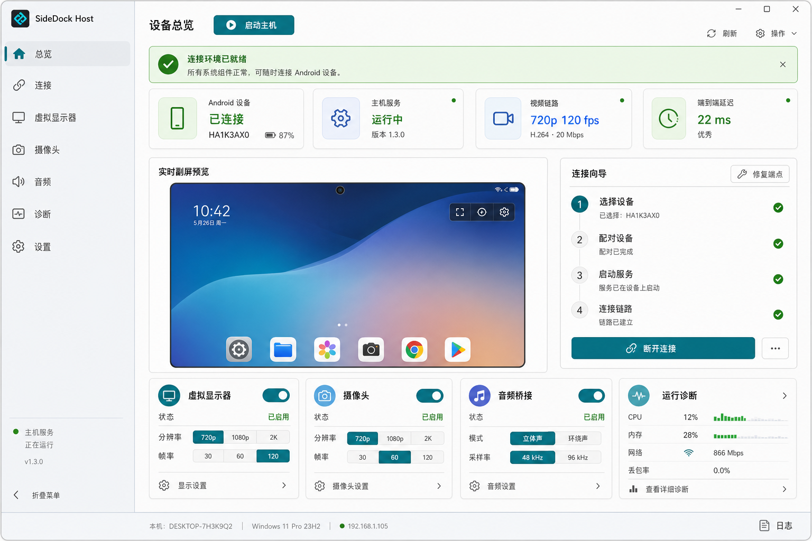
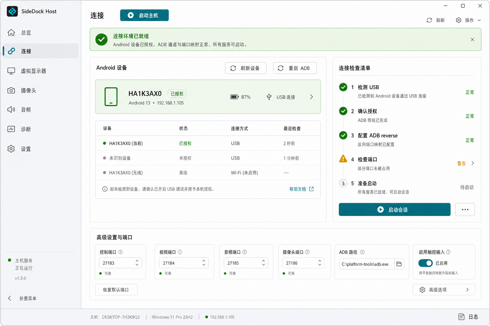
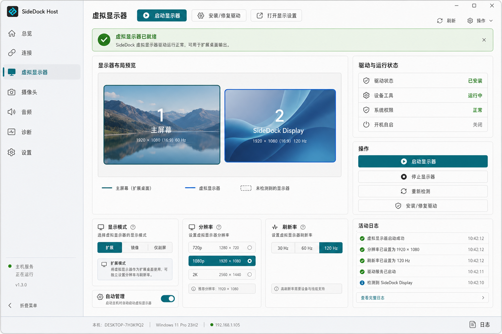
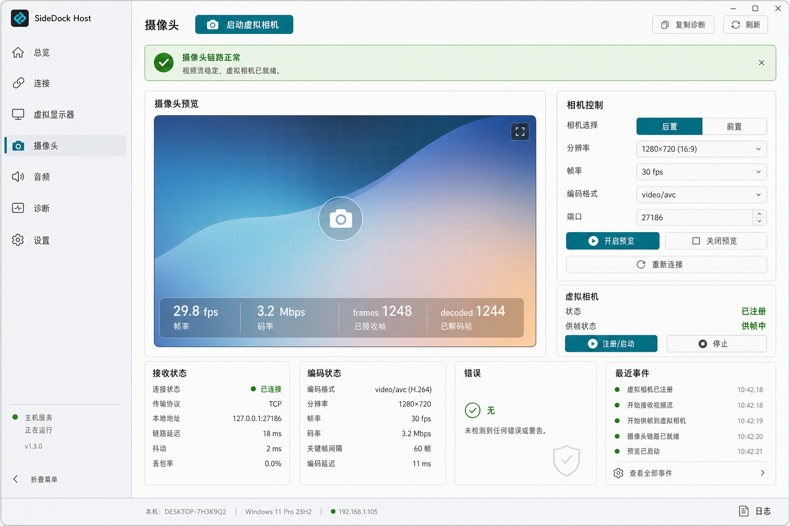
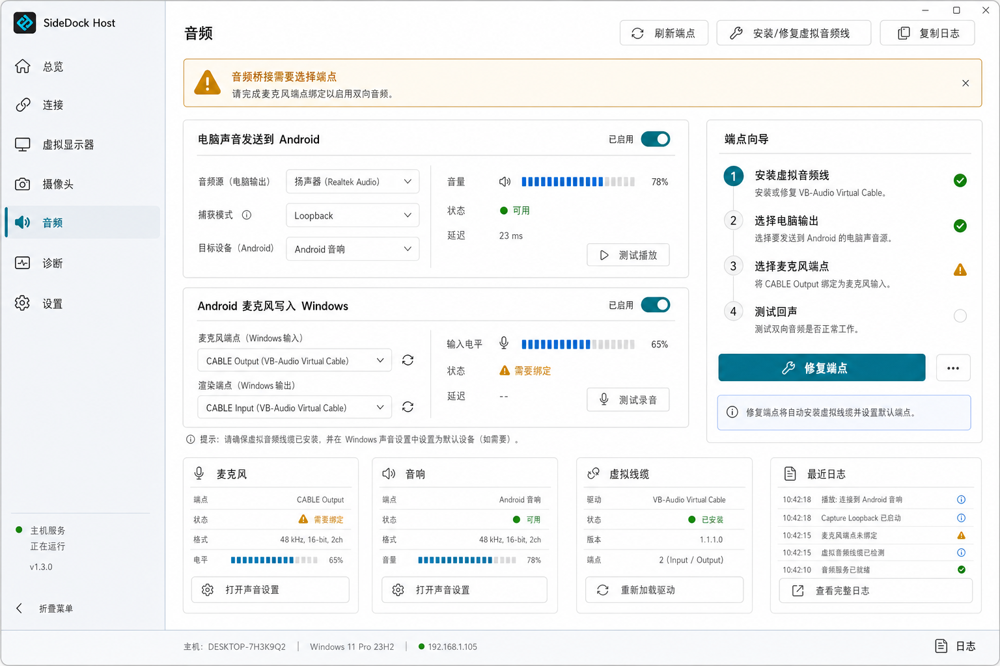
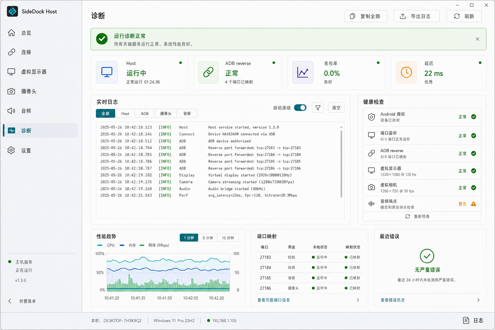
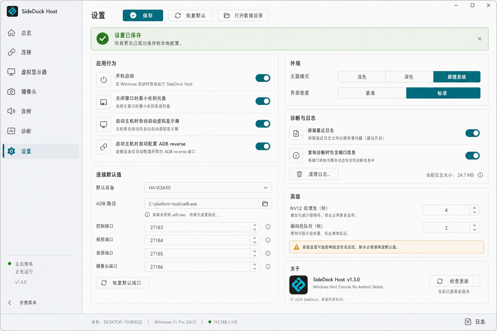
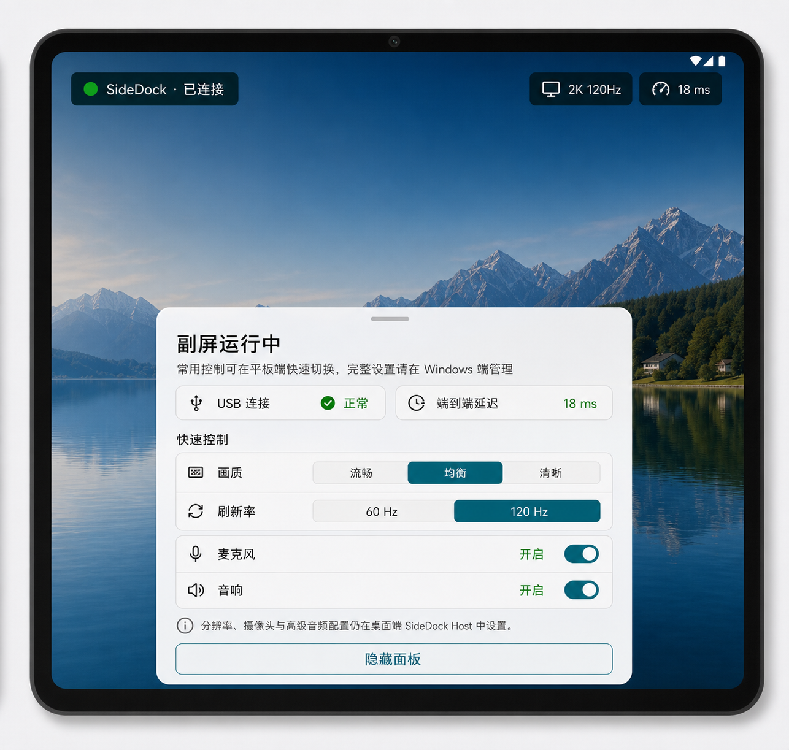
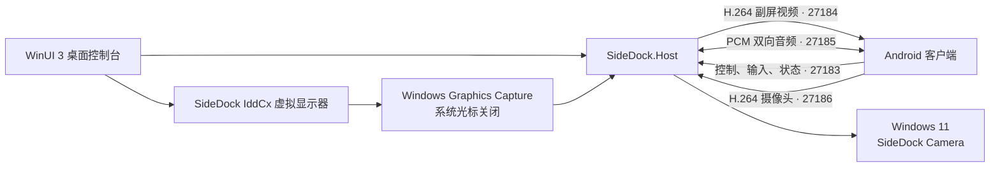
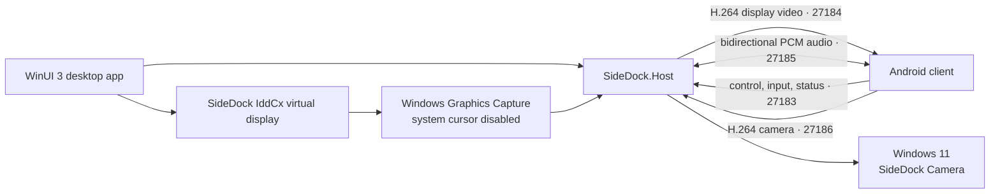

# SideDock

**中文** | [English](#english-version)

SideDock 通过 USB 把 Android 平板变成 Windows 副屏，并提供可选的双向音频、Android 摄像头上行、Windows 虚拟摄像头、输入回传和完整桌面管理界面。

> SideDock 目前仍是面向本地实验和开发验证的原型。自动发布的 `build-*` 版本不等同于稳定版；2K @ 120 Hz 等高规格取决于电脑 GPU/编码器、USB 链路、Android 解码器和面板能力。

[下载最新自动构建](https://github.com/naledao/SideDock/releases/latest) · [查看构建流程](.github/workflows/build.yml)

## 界面预览 / UI preview

> 以下图片来自当前 UI 重设计稿，用于展示界面方向；具体可用能力请以“当前已实现”和“当前限制与安全说明”为准。

### Windows 桌面端 / Windows desktop



| 连接 / Connection | 虚拟显示器 / Virtual display |
| --- | --- |
|  |  |

| 摄像头 / Camera | 音频 / Audio |
| --- | --- |
|  |  |

| 诊断 / Diagnostics | 设置 / Settings |
| --- | --- |
|  |  |

### Android 客户端 / Android client



## 当前已实现

| 能力 | 当前实现 |
| --- | --- |
| Windows 虚拟副屏 | 一个 IddCx 虚拟显示器；支持 1280×720、1920×1080、2560×1440，刷新率为 30/60/120 Hz |
| 显示模式 | 扩展、镜像、仅副屏；“仅副屏”带确认和超时恢复保护 |
| 低延迟视频 | Windows Graphics Capture（关闭系统光标）→ D3D11 BGRA/NV12 → Media Foundation H.264 → USB/ADB reverse → Android MediaCodec |
| 动态画质 | Windows 桌面端可切换分辨率、刷新率和显示拓扑；Android 端可请求 720p/1080p/2K 与 60/120 Hz |
| 输入回传 | 支持连接到 Android 的键盘、鼠标和触控板事件，包括移动、绝对坐标、按键与滚轮；Windows 光标在 Android 端合成显示 |
| 双向音频 | Windows 输出设备音频传到 Android；Android 麦克风传到 Windows；PCM S16LE 48 kHz，麦克风单声道、扬声器双声道 |
| Android 摄像头 | Camera2 + MediaCodec AVC/H.264 上行，支持前/后摄像头、预览、状态与恢复；Windows 11 可注册为 `SideDock Camera` |
| 桌面控制台 | WinUI 3 总览、设备选择、ADB reverse、驱动/显示器、摄像头、音频、诊断、日志、托盘、开机启动和更新检查 |

## 快速开始（推荐）

### 运行要求

- x64 Windows 10 版本 2004 / build 19041 或更新版本，或 Windows 11。
- Android 8.0 / API 26 或更新版本。
- 支持数据传输的 USB 线、已开启的 USB 调试，以及 Android 端对本机的 ADB 授权。
- Windows 11 build 22000 或更新版本才支持 Media Foundation 虚拟摄像头；副屏、音频和摄像头接收本身不要求 Windows 11。
- 2K/120 Hz 推荐使用支持对应 H.264 解码能力和高刷新率显示的 Android 设备。

发布版 Windows 程序是自包含的 win-x64 单文件，不要求另外安装 .NET SDK、Android SDK 或 ADB。若 Windows 无法识别设备，仍可能需要设备厂商的 ADB USB 驱动。

### 1. 下载

从 [Releases](https://github.com/naledao/SideDock/releases/latest) 下载：

- [`SideDock.Host.App.exe`](https://github.com/naledao/SideDock/releases/latest/download/SideDock.Host.App.exe)：Windows 桌面端，必需。
- [`SideDock.Android.Release.apk`](https://github.com/naledao/SideDock/releases/latest/download/SideDock.Android.Release.apk)：Android 客户端，必需。
- [`SideDock.Driver.Installer.exe`](https://github.com/naledao/SideDock/releases/latest/download/SideDock.Driver.Installer.exe)：独立显示驱动安装器，可选；同一安装器已经内置在桌面端中。

### 2. 安装 Android 客户端

可以直接在设备上打开 APK，也可以使用 ADB：

```powershell
adb install -r .\SideDock.Android.Release.apk
```

### 3. 连接并启动

1. 用 USB 连接 Android 设备，开启 USB 调试并接受“允许此电脑调试”的授权提示。
2. 运行 `SideDock.Host.App.exe`，在“连接”页刷新并选择设备。多台设备同时连接时必须明确选择目标设备。
3. 首次使用时，在“虚拟显示器”页点击“安装/修复驱动”并接受 UAC。
4. 选择分辨率、刷新率和显示模式，然后点击“启动主机”。
5. 打开 Android 上的 SideDock。客户端固定连接本机映射端口，并会在断线后自动重连。
6. 使用 Android 麦克风或摄像头时，按系统提示授予录音或摄像头权限；拒绝这些权限不影响基础副屏。

桌面端默认使用 1080p @ 120 Hz、扩展模式，并会在启动 Host 前自动配置所需的 ADB reverse、启动虚拟显示器工具和检查端口。

> 显示驱动是自动构建流程生成的自签名原型驱动。安装器会请求管理员权限，并把该构建的证书导入本机 `LocalMachine\Root` 和 `LocalMachine\TrustedPublisher` 信任存储。

## 架构与端口



| 默认端口 | 用途 | 方向 |
| --- | --- | --- |
| `27183` | JSON Lines 控制、输入、心跳和遥测 | 双向 |
| `27184` | H.264 副屏视频 | Windows → Android |
| `27185` | 48 kHz / 16-bit PCM 音频 | 双向 |
| `27186` | Android 摄像头 H.264 | Android → Windows |
| `27187` | 桌面 UI 到 Host 的摄像头/音频测试命令 | 仅 Windows 本机，不做 ADB reverse |

Host 和 Android 客户端都只使用 `127.0.0.1`。前四个端口通过 USB 的 ADB reverse 打通；当前没有 Wi-Fi/LAN 发现、配对或传输模式。

## 音频与摄像头

### 音频

桌面端当前推荐并强制使用 `wasapi-virtual-cable` 后端：

- 电脑声音：Host 使用 WASAPI loopback 捕获选定的 Windows 播放设备，再发送到 Android。
- Android 麦克风：Host 把 Android 的单声道 PCM 写入一个可写的 Windows 播放端点。使用 VB-CABLE 时，Host 选择 `CABLE Input`，通话软件选择对应的 `CABLE Output` 作为麦克风。
- 桌面端可以安装/修复当前发布流程内置的 VB-CABLE，也支持选择 Voicemeeter 端点。
- 已实现播放/录音测试、静音、端点状态和恢复建议；回声检测、96 kHz 和环绕声尚未实现。

`windows-driver/SideDock.Audio` 是独立的 legacy/实验 WDM 共享内存驱动，不属于当前推荐路径，也不会随显示驱动安装器安装。

### 摄像头

- Android 客户端使用 Camera2 采集，并通过 MediaCodec 编码为 AVC/H.264。
- Host 使用 Media Foundation 解码，桌面端提供预览、前后镜头选择、请求分辨率/FPS、日志和恢复状态。
- 请求的模式会按 Android 摄像头和编码器能力调整到最接近的可用模式。
- Windows 11 可把画面注册为 `SideDock Camera`，供会议或直播软件选择；该虚拟摄像头 API 在 Windows 10 上不可用。
- 当前接收链路只支持 AVC/H.264，不应把界面中出现的 HEVC 选项视为已完成能力。

## 从源码构建

### 开发环境

- .NET SDK 8；仓库的 [`global.json`](global.json) 固定 `8.0.411`。
- JDK 17、Gradle 8.10.2、Android SDK Platform 34 和 Build Tools 34.0.0。
- 仓库没有提交 Gradle Wrapper，需要系统中有 `gradle.bat`。
- 构建显示驱动或原生虚拟摄像头时，需要 Visual Studio 2022 C++ 工具链、MSBuild/NuGet，以及 Windows SDK/WDK；CI 使用 10.0.26100。

### Windows 桌面端

源码启动必须先构建 Host，再构建 App，最后启动 App：

```powershell
dotnet build .\windows-host\SideDock.Host\SideDock.Host.csproj --configuration Debug
dotnet build .\windows-host\SideDock.Host.App\SideDock.Host.App.csproj --configuration Debug

& .\windows-host\SideDock.Host.App\bin\Debug\net8.0-windows10.0.19041.0\win-x64\SideDock.Host.App.exe
```

本地源码 App 会查找前一步生成的 `SideDock.Host.exe`，不依赖发布打包使用的 `HostPayload.zip`。普通 `dotnet build` 也不会自动生成完整发布版中的驱动安装器、ADB、VB-CABLE 和虚拟摄像头负载；需要完整功能时优先使用 Release，完整打包过程以 [`.github/workflows/build.yml`](.github/workflows/build.yml) 为准。

### Android 客户端

```powershell
gradle.bat -p .\android-client :app:assembleDebug --no-daemon
adb install -r .\android-client\app\build\outputs\apk\debug\app-debug.apk
adb shell am start -n com.sidedock.client/.MainActivity
```

### 显示驱动

在 Visual Studio Developer PowerShell 中：

```powershell
msbuild .\windows-driver\SideDock.Driver.sln /m /p:Configuration=Debug /p:Platform=x64 /p:SkipPackageVerification=true
```

构建成功不代表驱动已可安装：驱动仍需签名、证书信任和管理员安装，且 `SideDock.Idd.DeviceTool.exe` 必须持续运行才能保留软件显示设备。开发安装细节见 [SideDock.Idd README](windows-driver/SideDock.Idd/README.md)。

### 高级 CLI

若只调试副屏视频，可绕过桌面 UI 直接运行 Host。CLI 默认是 720p @ 120 Hz，输入注入默认关闭；下面的最小命令显式启用输入，并关闭需要额外端点/权限的音频和摄像头：

```powershell
dotnet run --project .\windows-host\SideDock.Host\SideDock.Host.csproj -- --video-source idd-gpu --resolution 1080p --refresh-rate 120 --enable-input-injection --disable-audio --disable-camera
```

CLI Host 也会自动配置并每 5 秒检查 ADB reverse。可用 `SIDEDOCK_ADB` 指定 ADB 路径、用 `ANDROID_SERIAL` 选择设备，或用 `SIDEDOCK_SKIP_ADB_REVERSE=1` 显式跳过自动配置。

仅在排查或关闭自动配置时，才需要手动执行：

```powershell
adb devices -l
adb -s <serial> reverse tcp:27183 tcp:27183
adb -s <serial> reverse tcp:27184 tcp:27184
adb -s <serial> reverse tcp:27185 tcp:27185
adb -s <serial> reverse tcp:27186 tcp:27186
```

## 当前低延迟链路

当前默认 `idd-gpu` 名称保留自早期实现，但实际活动路径已经更新：

1. `SideDock.Idd` 向 Windows 暴露虚拟显示器。
2. Host 使用 Windows Graphics Capture 直接捕获该显示器，frame pool 固定为 2 个缓冲，关闭系统光标，并在每次读取时排空过期帧、只保留最新帧。
3. Host 通过 D3D11 完成 BGRA → NV12 转换，并使用 Media Foundation H.264 编码；编码器不支持直接 D3D11 输入时会走兼容回退。
4. 各阶段使用“latest frame”交接和短有界队列。没有新桌面帧时，Host 会生成重复帧以维持目标码流节拍。
5. Android socket 线程把包写入 12 槽解码队列，队列满时丢弃最旧数据；专用线程把数据送入低延迟 MediaCodec。硬解被判定为不支持时会尝试软件解码器。
6. 系统光标不进入采集画面；Host 单独传输光标形状/位置，Android 根据设置的缩放比例合成光标。

可调参数：

| 层 | 参数 | 默认值 |
| --- | --- | --- |
| WGC frame pool | 编译期固定 | 2 |
| Host NV12 纹理池 | `--nv12-pool-size` | 4 |
| Host 编码包队列 | `--encoded-packet-queue` | 2 |
| Android 解码队列 | `DECODE_QUEUE_CAPACITY` | 12 |
| Android 合成光标 | `--android-cursor-scale-percent` | 100% |

驱动仍保留 `GpuRingSlots` 注册表值和共享 GPU ring 代码，但当前默认 `idd-gpu` Host 路径不消费它，因此它不是当前链路的有效调优项。`--video-source idd` 仍可使用驱动的 CPU 共享 BGRA 缓冲作为开发回退。

桌面端“诊断”页和 Android 覆盖层会显示 capture/convert/encode/decode/render FPS、延迟、丢帧、重连、音频与摄像头状态；诊断页还可复制或导出日志包。

## 当前限制与安全说明

- 当前是 USB + ADB reverse 方案，不支持 Wi-Fi/LAN。
- TCP 协议没有应用层 TLS 或认证；设计前提是可信电脑与已授权的本地 ADB USB 隧道。
- 当前一次只面向一个 Android 会话和一个 SideDock 虚拟显示器。
- 普通手指触摸目前只用于显示/隐藏 Android 控制层，不会作为 Windows 触控或多点触控回传；输入回传目前以 Android 外接键盘、鼠标和触控板为主。
- 2K @ 120 Hz 是可选预设，不是所有设备上的性能保证。
- Windows 多屏镜像要求显示器具有兼容模式；复杂拓扑可能无法切换，应用会尽量校验并回滚。
- Windows 虚拟摄像头仅支持 Windows 11；摄像头上行当前仅支持 AVC/H.264。
- Android 麦克风写入普通 Windows 应用通常需要 VB-CABLE 或 Voicemeeter；回声消除尚未实现。
- Windows 发布程序没有 Authenticode 签名步骤；显示驱动使用构建时生成的自签名证书。

## 项目结构

| 路径 | 说明 |
| --- | --- |
| `android-client` | 原生 Java Android 客户端：视频解码、音频、Camera2、输入与状态界面 |
| `windows-host/SideDock.Host` | 控制、视频、音频、摄像头和输入处理后台 |
| `windows-host/SideDock.Host.App` | WinUI 3 桌面控制台 |
| `windows-host/SideDock.Host.Launcher` | 发布版单文件解包与启动器 |
| `windows-driver/SideDock.Idd` | UMDF/IddCx 虚拟显示驱动 |
| `windows-driver/SideDock.Idd.DeviceTool` | 创建并保持虚拟软件设备 |
| `windows-driver/SideDock.Driver.Installer` | 自签显示驱动的安装/修复工具 |
| `windows-host/SideDock.VirtualCamera.Tool` | Windows 11 虚拟摄像头注册与控制 |
| `windows-host/SideDock.VirtualCamera.MediaSource` | Media Foundation 虚拟摄像头媒体源 |
| `windows-driver/SideDock.Audio` | legacy/实验 WDM 音频驱动，不属于推荐发布路径 |

## 排查

- **检测不到设备：**运行 `adb devices -l`，确认状态为 `device` 而不是 `unauthorized`；重新插线并确认 Android 授权提示，必要时安装 OEM ADB USB 驱动。
- **Android 一直等待 Host：**在桌面端“诊断”页检查四个监听端口和 reverse 映射，或执行上面的四条手动 reverse 命令。
- **看不到虚拟显示器：**在“虚拟显示器”页安装/修复驱动，并确认 `SideDock.Idd.DeviceTool.exe` 正在运行；再打开 Windows 显示设置。
- **没有电脑声音：**选择实际正在播放声音的 Windows 输出设备并运行“测试播放”。
- **Android 麦克风不可用：**授予 Android 录音权限，配置 VB-CABLE/Voicemeeter，并在通话软件中选择对应录制端点。
- **虚拟摄像头不可用：**确认系统为 Windows 11 build 22000+、Android 已授予摄像头权限，并在“摄像头”页注册/启动虚拟相机。
- **日志位置：**`%LOCALAPPDATA%\SideDock\logs`；设置文件为 `%LOCALAPPDATA%\SideDock\HostApp\settings.json`。

## 第三方代码与许可

仓库目前没有声明统一的仓库级许可证。`SideDock.Idd` 基于 Microsoft IddCx 示例精简而来，相关代码保留 [MS-PL](windows-driver/LICENSE-MS-PL.txt)；VB-CABLE 及其它第三方组件分别受其各自许可条款约束。分发前请自行核对对应条款。

---

# English version

[中文](#sidedock) | **English**

## SideDock

SideDock turns an Android tablet into a Windows secondary display over USB, with optional bidirectional audio, Android camera uplink, a Windows virtual camera, input forwarding, and a WinUI desktop control center.

> SideDock is still an experimental prototype. Automated `build-*` releases are development snapshots rather than guaranteed stable releases. Modes such as 2K @ 120 Hz depend on the Windows GPU/encoder, USB path, Android decoder, and panel refresh rate.

[Download the latest automated build](https://github.com/naledao/SideDock/releases/latest) · [View the build workflow](.github/workflows/build.yml)

## Implemented features

| Feature | Current implementation |
| --- | --- |
| Virtual display | One IddCx monitor with 1280×720, 1920×1080, and 2560×1440 modes at 30/60/120 Hz |
| Presentation modes | Extend, mirror, and SideDock-only, with confirmation and timed rollback for SideDock-only |
| Low-latency video | Windows Graphics Capture with cursor capture disabled → D3D11 BGRA/NV12 → Media Foundation H.264 → USB/ADB reverse → Android MediaCodec |
| Runtime mode control | Resolution, refresh rate, and Windows presentation mode from the desktop app; 720p/1080p/2K and 60/120 Hz requests from Android |
| Input forwarding | Keyboard, mouse, and touchpad events attached to Android, including motion, absolute position, buttons, and wheel; Windows cursor composited on Android |
| Bidirectional audio | Windows output to Android and Android microphone to Windows; PCM S16LE 48 kHz, mono microphone and stereo speaker |
| Android camera | Camera2 + MediaCodec AVC/H.264 uplink, front/back selection, preview, telemetry, recovery, and `SideDock Camera` on Windows 11 |
| Desktop control center | WinUI 3 overview, device selection, ADB reverse, driver/display, camera, audio, diagnostics, logs, tray, startup, and update checks |

## Quick start

### Runtime requirements

- x64 Windows 10 version 2004 / build 19041 or newer, or Windows 11.
- Android 8.0 / API 26 or newer.
- A USB data cable, USB debugging, and Android authorization for the Windows computer.
- The Media Foundation virtual camera requires Windows 11 build 22000 or newer. The display, audio bridge, and camera receiver do not otherwise require Windows 11.
- A capable Android H.264 decoder and high-refresh panel are recommended for 2K/120 Hz.

The Windows release is a self-contained win-x64 single-file launcher; end users do not need the .NET SDK, Android SDK, or a separate ADB installation. An OEM ADB USB driver may still be required if Windows does not expose the device.

### Download and run

Download these assets from [Releases](https://github.com/naledao/SideDock/releases/latest):

- [`SideDock.Host.App.exe`](https://github.com/naledao/SideDock/releases/latest/download/SideDock.Host.App.exe), required.
- [`SideDock.Android.Release.apk`](https://github.com/naledao/SideDock/releases/latest/download/SideDock.Android.Release.apk), required.
- [`SideDock.Driver.Installer.exe`](https://github.com/naledao/SideDock/releases/latest/download/SideDock.Driver.Installer.exe), optional standalone driver repair tool; the same installer is embedded in the desktop app.

Then:

1. Install the APK on Android. From ADB, use `adb install -r .\SideDock.Android.Release.apk`.
2. Connect the device over USB, enable USB debugging, and accept the authorization prompt.
3. Run `SideDock.Host.App.exe`, refresh the Connection page, and select the device. Explicitly select a serial when more than one device is connected.
4. On first use, choose **Install/repair driver** on the Virtual Display page and accept UAC.
5. Choose a resolution, refresh rate, and presentation mode, then select **Start host**.
6. Open SideDock on Android. The client connects through the loopback ports exposed by ADB reverse and reconnects automatically.
7. Grant microphone or camera permission only when using those optional features.

The desktop app defaults to 1080p @ 120 Hz in extend mode and automatically configures ADB reverse, starts the virtual-display device tool, and checks the required ports.

> The display driver is a prototype self-signed driver produced by the automated workflow. Its installer requests administrator access and imports the build certificate into `LocalMachine\Root` and `LocalMachine\TrustedPublisher`.

## Architecture and ports



| Default port | Purpose | Direction |
| --- | --- | --- |
| `27183` | JSON Lines control, input, heartbeat, and telemetry | Bidirectional |
| `27184` | H.264 display video | Windows → Android |
| `27185` | 48 kHz / 16-bit PCM audio | Bidirectional |
| `27186` | Android H.264 camera | Android → Windows |
| `27187` | Desktop-to-Host camera and audio-test commands | Windows loopback only; not reversed |

The Host and Android clients bind/connect only to `127.0.0.1`. The first four ports are bridged over USB with ADB reverse. There is currently no Wi-Fi/LAN discovery, pairing, or transport mode.

## Audio and camera

The desktop app uses the `wasapi-virtual-cable` audio backend:

- Host captures a selected Windows render device through WASAPI loopback and sends it to Android.
- Host writes the Android mono microphone stream to a writable Windows render endpoint. With VB-CABLE, Host targets `CABLE Input` and conferencing software selects `CABLE Output` as its microphone.
- The current release workflow embeds VB-CABLE, and the UI also supports Voicemeeter endpoints.
- Playback/record tests, mute controls, endpoint health, and recovery guidance are implemented. Echo detection, 96 kHz, and surround audio are not.

`windows-driver/SideDock.Audio` is an independent legacy/experimental WDM shared-memory driver. It is not the recommended desktop path and is not installed with the display driver.

For the camera path, Android captures through Camera2 and encodes AVC/H.264 with MediaCodec. Host decodes with Media Foundation and exposes preview, lens/mode controls, telemetry, and recovery status. Requested modes may be adjusted to the nearest supported device/encoder mode. Windows 11 can register the frames as `SideDock Camera`; Windows 10 cannot use that virtual-camera API. The current receiver supports AVC/H.264 only, not HEVC.

## Build from source

### Toolchain

- .NET SDK 8; [`global.json`](global.json) pins `8.0.411`.
- JDK 17, Gradle 8.10.2, Android SDK Platform 34, and Build Tools 34.0.0.
- No Gradle Wrapper is committed, so `gradle.bat` must be available.
- Visual Studio 2022 C++, MSBuild/NuGet, and a Windows SDK/WDK are required for the display driver or native virtual camera; CI uses 10.0.26100.

### Windows desktop app

Build the backend first, then the desktop app, and finally launch the app:

```powershell
dotnet build .\windows-host\SideDock.Host\SideDock.Host.csproj --configuration Debug
dotnet build .\windows-host\SideDock.Host.App\SideDock.Host.App.csproj --configuration Debug

& .\windows-host\SideDock.Host.App\bin\Debug\net8.0-windows10.0.19041.0\win-x64\SideDock.Host.App.exe
```

The source app locates the previously built `SideDock.Host.exe`; it does not depend on the release-only `HostPayload.zip`. A normal local `dotnet build` does not create the full release payload containing the driver installer, ADB, VB-CABLE, and virtual-camera binaries. Use the Release build for the complete packaged experience, or follow [`.github/workflows/build.yml`](.github/workflows/build.yml).

### Android

```powershell
gradle.bat -p .\android-client :app:assembleDebug --no-daemon
adb install -r .\android-client\app\build\outputs\apk\debug\app-debug.apk
adb shell am start -n com.sidedock.client/.MainActivity
```

### Display driver

From a Visual Studio Developer PowerShell:

```powershell
msbuild .\windows-driver\SideDock.Driver.sln /m /p:Configuration=Debug /p:Platform=x64 /p:SkipPackageVerification=true
```

A successful build is not an installed driver: signing, certificate trust, administrator installation, and a continuously running `SideDock.Idd.DeviceTool.exe` are still required. See the [SideDock.Idd README](windows-driver/SideDock.Idd/README.md).

### Advanced Host CLI

For display-only debugging, run Host directly. The CLI defaults to 720p @ 120 Hz and leaves input injection disabled; this minimal example enables input and disables the optional audio/camera paths:

```powershell
dotnet run --project .\windows-host\SideDock.Host\SideDock.Host.csproj -- --video-source idd-gpu --resolution 1080p --refresh-rate 120 --enable-input-injection --disable-audio --disable-camera
```

The CLI Host also configures ADB reverse automatically and checks it every five seconds. Use `SIDEDOCK_ADB` to choose an ADB executable, `ANDROID_SERIAL` to select a device, or `SIDEDOCK_SKIP_ADB_REVERSE=1` to skip automatic mapping.

Only for troubleshooting or when automatic mapping is disabled:

```powershell
adb devices -l
adb -s <serial> reverse tcp:27183 tcp:27183
adb -s <serial> reverse tcp:27184 tcp:27184
adb -s <serial> reverse tcp:27185 tcp:27185
adb -s <serial> reverse tcp:27186 tcp:27186
```

## Current low-latency path

The `idd-gpu` name remains from an earlier implementation, but the active path has changed:

1. `SideDock.Idd` exposes the virtual monitor to Windows.
2. Host captures that monitor through Windows Graphics Capture with a fixed two-buffer frame pool and cursor capture disabled. It drains superseded frames and keeps only the newest one.
3. Host converts BGRA to NV12 through D3D11 and encodes H.264 with Media Foundation, with a compatibility fallback when direct D3D11 encoder input is unavailable.
4. Pipeline hand-offs use latest-frame semantics and short bounded queues. Host emits repeat frames when no new desktop frame is ready, maintaining stream cadence without accumulating stale work.
5. Android uses a 12-slot drop-oldest packet queue feeding a dedicated low-latency MediaCodec thread. It conditionally tries a software decoder when hardware decode is classified as unsupported.
6. The system cursor is excluded from capture; Host sends cursor shape/position separately and Android composites it at the configured scale.

| Layer | Setting | Default |
| --- | --- | --- |
| WGC frame pool | Compile-time fixed | 2 |
| Host NV12 texture pool | `--nv12-pool-size` | 4 |
| Host encoded-packet queue | `--encoded-packet-queue` | 2 |
| Android decode queue | `DECODE_QUEUE_CAPACITY` | 12 |
| Android cursor scale | `--android-cursor-scale-percent` | 100% |

The driver still contains the `GpuRingSlots` registry setting and shared GPU-ring implementation, but the current default `idd-gpu` Host path does not consume it. It is therefore not an active tuning knob. `--video-source idd` remains available as a CPU shared-BGRA development fallback.

The desktop Diagnostics page and Android overlay expose capture/convert/encode/decode/render throughput, latency, drops, reconnects, audio state, and camera state, with copy/export support for diagnostic logs.

## Current limitations and security notes

- USB + ADB reverse only; no Wi-Fi/LAN transport.
- The TCP protocol has no application-layer TLS or authentication and assumes a trusted PC plus an authorized local ADB USB tunnel.
- One Android session and one SideDock virtual display at a time.
- Ordinary finger touch currently toggles the Android control overlay; it is not forwarded as Windows touch or multitouch. Input forwarding currently targets keyboards, mice, and touchpads attached to Android.
- 2K @ 120 Hz is an available preset, not a performance guarantee.
- Mirror mode requires compatible display modes, and complex multi-monitor topologies may be rejected and rolled back.
- The Windows virtual camera requires Windows 11 and currently accepts AVC/H.264 only.
- Routing the Android microphone into normal Windows applications usually requires VB-CABLE or Voicemeeter; echo cancellation is not implemented.
- Windows release binaries are not Authenticode-signed by the current workflow; the display driver uses a generated self-signed certificate.

## Project layout

| Path | Purpose |
| --- | --- |
| `android-client` | Native Java Android client: video decode, audio, Camera2, input, and status UI |
| `windows-host/SideDock.Host` | Control, video, audio, camera, and input backend |
| `windows-host/SideDock.Host.App` | WinUI 3 desktop control center |
| `windows-host/SideDock.Host.Launcher` | Release single-file extraction and launcher |
| `windows-driver/SideDock.Idd` | UMDF/IddCx virtual display driver |
| `windows-driver/SideDock.Idd.DeviceTool` | Creates and keeps the software display device alive |
| `windows-driver/SideDock.Driver.Installer` | Self-signed display-driver install/repair tool |
| `windows-host/SideDock.VirtualCamera.Tool` | Windows 11 virtual-camera registration and control |
| `windows-host/SideDock.VirtualCamera.MediaSource` | Media Foundation virtual-camera media source |
| `windows-driver/SideDock.Audio` | Legacy/experimental WDM audio driver, not the recommended release path |

## Troubleshooting

- **No device:** run `adb devices -l`; the state must be `device`, not `unauthorized`. Reconnect the cable, accept the Android prompt, and install the OEM ADB USB driver if needed.
- **Android keeps waiting:** inspect all four listeners and reverse mappings on the Diagnostics page, or apply the four manual mappings above.
- **No virtual display:** install/repair the driver, confirm `SideDock.Idd.DeviceTool.exe` is running, and open Windows Display Settings.
- **No Windows audio on Android:** choose the Windows output device that is actually playing sound, then run the playback test.
- **Android microphone unavailable:** grant Android microphone permission, configure VB-CABLE/Voicemeeter, and select the matching recording endpoint in the calling app.
- **Virtual camera unavailable:** use Windows 11 build 22000+, grant Android camera permission, and register/start the virtual camera from the Camera page.
- **Logs:** `%LOCALAPPDATA%\SideDock\logs`; settings are stored in `%LOCALAPPDATA%\SideDock\HostApp\settings.json`.

## Third-party code and licensing

The repository does not currently declare a repository-wide license. `SideDock.Idd` is reduced from Microsoft's IddCx sample and retains the [MS-PL](windows-driver/LICENSE-MS-PL.txt). VB-CABLE and other third-party components remain subject to their respective license terms; review those terms before redistribution.
